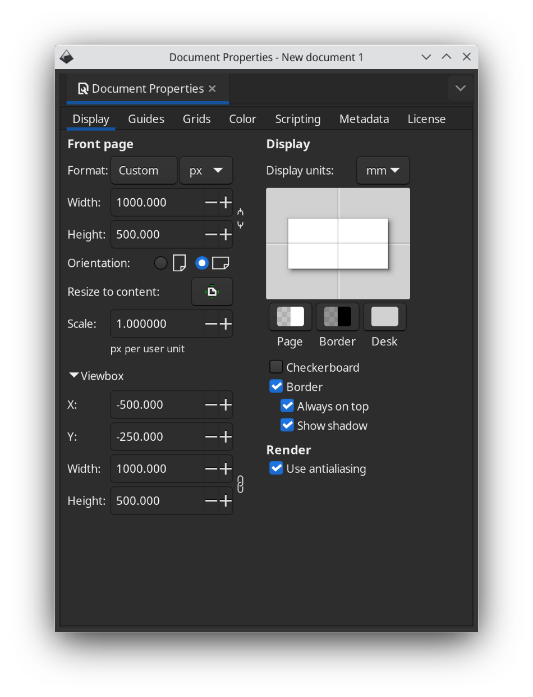

Defining a path with inkscape
=============================

Installation
------------
 * If you haven't done so, download and install inkscape from https://inkscape.org or using your favorite package manager.

Setting up the scene
--------------------
 * Start inkscape, create a new document. In File -> Document Properties, set up the page size to 1000x500 pixels (or whatever your chosen size).
 * In that same dialog, also edit the viewBox coordinates to -W/2 -H/2 W H, where W is the width of your drawing and H is the height of your drawing.

Drawing a shape
---------------
 * You can now draw objects and paths onto the canvas.
 * Convert all objects to paths using Path -> Object to Path
 * For every path, check its orientation by using the Object -> Fill and stroke -> Stroke style and adding a middle arrow. This will show you how the text will flow around the path.
 * You can also check the starting point of a path by adding a start arrow.
 * If needed, use Path -> Reverse and/or Object -> Flip horizontal/Flip vertical to correct the orientation of the path.
 * You can also further resize and align the paths onto your scene as desired.
 * Disable the arrows again
 * Make sure to use Path -> Union, Difference, Intersection, etc operations as needed so you end up with a single path.

Measuring the path
------------------
 * If you intend to animate the textOffset parameter, it is very useful to know how long the path is.
 * You can find out using the Extensions -> Visualize Path -> Measure Path
 * Set measurement type to Length, check Live Preview and play with the Offset slider in the Text on Path to see which offsets correspond to which positions.

    .. image:: ../docs/pictures/inkscapemeasurement.png

 * TODO: how to renumber nodes

