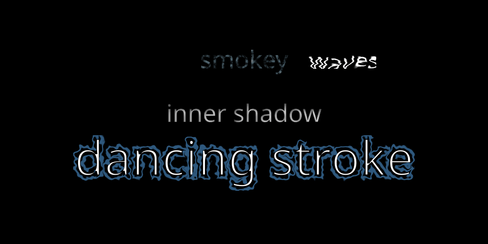

.. role:: toml(code)
   :language: toml

Installation
============
Before you do anything else, make sure to install inkscape, e.g. from https://inkscape.org or using your favourite package manager.

- Then, clone the camala code from github:
    .. code-block::

        git clone https://github.com/shimpe/camala

- Second, on the command line create a virtual environment
    .. code-block::

        cd camala
        python3 -m venv venv

- Third, on the command line activate the virtual environment
    .. code-block::

        [for windows] venv\Scripts\activate.bat
        [for linux/MacOS] source venv/bin/activate

- Fourth, on the command line install the requirements
    .. code-block::

        python -m pip install -r requirements.txt

- Fifth, on the command line you can now run the simple ui with
    .. code-block::

        python src/main.py

  Alternatively, you can regenerate all the examples described in the documentation with

    .. code-block::

        python src/captiongenerator.py

- Sixth, if you want to regenerate the html documentation you will need to install sphinx and run make html in the docs folder. Luckily the documentation is readable online at https://shimpe.github.io/camala
    .. code-block::

        pip install sphinx
        cd docs
        make html

- Finally, when finished, you can deactivate the virtual environment with
    .. code-block::

        deactivate

Getting Started
===============

Camala (CAption MArkup LAnguage) is a system to generate animated captions.
It uses svg, moviepy and inkscape to generate movies from a .toml document
with caption generation instructions.

First caption
-------------

The Camala language consists of a number of sections with caption generation instruction, some of which are optional.
A small camala specification looks as follows:

.. image:: ../examples/gettingstarted/outputs/simple.gif
.. literalinclude:: ../examples/gettingstarted/simple.toml
  :language: toml

1. there's a :toml:`[Global]` section. In this section some properties of the generated movie clip are setup. These properties include:

   - W for width [pixels]
   - H for height [pixels]
   - duration [seconds]
   - fps [1/seconds] (frames per second - useful in case animations are present)
   - format [string] (allowed formats: svg, gif, mp4)
   - background [#rrggbb hex color or color name]
#. there's an :toml:`Animations` section. This section must always be present, but can be left empty
#. there's a :toml:`Styles.name.StyleProperties` section. In the Styles section, we define how captions look. Here you can specify anything you could also specify in CSS (inkscape will do the final interpretation). Typical keys you define here are `fill` for letter color, `stroke` for outline color, `stroke-width` for outline thickness, `font-size` for font size, `font-family` for font name, `font-style` for normal/oblique, and many others.
#. there's a :toml:`Caption` section which describes the text that must appear. In this case, the text consists of a single line with position [0, 0] and it uses the normal style defined in the Styles section. In general, captions can consist of multiple lines (each with their own position), and every line can consist of multiple segments, each with their own style.

Changing font properties mid-way
--------------------------------
Suppose you want to change the color of the text mid-way the sentence. This can be accomplished by defining an extra style and dividing the line in different segments as shown below:

.. literalinclude:: ../examples/gettingstarted/simple-colorchange.toml
   :language: toml

Animating style parameters
--------------------------
Suppose you want the text "in the middle" to change size over time. This can be done by specifying an animation in the Animations section,
and referring to it from the Styles section.

.. literalinclude:: ../examples/gettingstarted/simple-animatedstyle.toml
  :language: toml

Notice how the :toml:`font-size` now has a value of :toml:`"${Animations.Style.grow}"`, and the :toml:`Animations.Style.grow` section
describes a NumberAnimation from 0 to 50 with tweening.
In the Style definition where the animation is used, there's now also a StyleAnimation section added, which says when the
animation starts animating, and when it stops animating.

Animating multiple style parameters
-----------------------------------
You can animate multiple style parameters independently. E.g. here I also change the letter-spacing of the first line segment.

.. literalinclude:: ../examples/gettingstarted/simple-animatedstyle2.toml
  :language: toml

Sequencing style animations
---------------------------
You can sequence different animations one after the other into a new animation by using SequentialAnimation instead of NumberAnimation.
E.g. here's an example of sequencing a grow and shrink animation to get a pulsing animation.

.. literalinclude:: ../examples/gettingstarted/sequential-style-animation.toml
  :language: toml

Notice how the SequentialAnimation takes different parameters from a NumberAnimation. SequentialAnimation takes a list of animations and
will perform these one after the other.

 - :toml:`elements` contains the list of animations to sequence
 - :toml:`time_weights` describes how much of the total animation time should be spent in each of the child animations
 - :toml:`repeats` says how often the sequence must be repeated
 - :toml:`tween` allows to specify an extra tweening on top of the already present tweening in the child animations

Animating the position
----------------------

In addition to animating the appearance of the text it's also possible to animate the position of the text. This is accomplished by adding a
Position section in the Animations and referring to it from the Caption.line pos field.

.. image:: ../examples/gettingstarted/outputs/position-animation.gif
.. literalinclude:: ../examples/gettingstarted/position-animation.toml
  :language: toml

Summing animations
-------------------

If you want to lower two lines from the top of the screen to the bottom of the screen, maybe you want to reuse the same top_to_bottom animation,
but specify a constant offset between the positions of the first and second line. This is possible with a SumAnimation.

.. image:: ../examples/gettingstarted/outputs/position-sumanimation.gif
.. literalinclude:: ../examples/gettingstarted/position-sumanimation.toml
  :language: toml

Of course you can also sum more complex animations.

TextProvider and TextProviderAnimation
--------------------------------------
Sometimes you may want text to appear or disappear character by character (e.g. like in a typewriter effect).
In Camala this is possible by creating an Animations.TextProvider.name animation. Such Animation must generate
numbers between 0 and 100 where 0 means that a single character is shown, and 100 means 100% of all characers are shown.
You can also generate negative numbers up to -100. If the animation produces a negative value V than the last V pct of
characters are shown instead of the first V pct of characters. Here's an example:

.. image:: ../examples/gettingstarted/outputs/textprovider.gif
.. literalinclude:: ../examples/gettingstarted/textprovider.toml
  :language: toml

Playing with CaptionSvgAttribute and SegmentSvgAttribute
--------------------------------------------------------

The animated captions are made by generating an svg for every frame, and rendering it to png with inkscape (and later to .gif or .mp4 with moviepy).
If desired  you can directly inject some attributes into the <text> and <tspan> elements.
A Caption is translated into <text>; a segment is translated into <tspan>.
Some attributes cannot be specified in a style (or rather: you can specify them but they don't work as expected). One such
example is the "rotate" attribute. If you want to rotate characters with the rotate attribute, you need to specify it with a
CaptionSvgAttribute or a SegmentSvgAttribute. CaptionSvgAttribute and SegmentSvgAttribte can be animated. See here a complex example
combining many of the techniques mentioned before:

.. image:: ../examples/gettingstarted/outputs/complex.gif
.. literalinclude:: ../examples/gettingstarted/complex.toml
  :language: toml

Text along a path
=================

Sometimes you may want text to follow a curved path instead of a straight line. SVG has provisions for doing exactly that.
The way you can tap into these possibilities with camala is as follows:

First you need to define a path in the (optional) Paths section. The easiest way to come up with a path definition, is to create one in a program like inkscape.
Then copy the path definition from inkscape's XML editor. If you work with objects in inkscape, be sure to convert them to path. If you have multiple paths in inkscape, be sure to merge them together into a single path (see separate section on defining a path with inkscape for some tips and tricks).

.. code-block:: toml

    [Paths.mypath]
    d = "M -78.852544,-240.20076 C 58.855926,-262.32979 196.64283,-169.19795 218.39473,-29.553448 237.98768,96.230928 152.64092,221.95741 24.908313,241.1001 -88.950691,258.16363 -202.62691,180.59621 -219.15153,64.774609 -233.69446,-37.157379 -163.89861,-138.7972 -59.986937,-152.69151 30.015762,-164.72602 119.63885,-102.69091 130.88547,-10.687839 140.42892,67.382399 86.138653,145.01798 6.042703,153.59086 -60.090315,160.66925 -125.78459,114.09913 -131.64228,45.909002 -136.29716,-8.2790466 -97.40527,-62.111562 -41.121326,-65.182267 1.1071754,-67.486139 43.232919,-36.191314 43.376226,8.1777716 43.473873,38.41142 19.577331,69.196211 -12.822905,66.081605 -30.936089,64.340402 -51.542578,47.057084 -44.133023,27.043382 c 2.734212,-7.38529 19.039637,-17.8791264 21.877312,-4.716401"

Next, in a Caption.line you need to reference the path instead of the position:

.. code-block:: toml

    [Caption.Line1]
    path = "${Paths.mypath}"

You can set up path properties in the PathProperties section, e.g.

.. code-block:: toml

    [Caption.Line1.PathProperties]
    lengthAdjust = "spacing" # or spacingAndGlyphs
    method = "align" # or stretch
    side = "left" # or right
    spacing = "auto" # or auto
    startOffset = "${Animations.Path.increase}"
    #textLength = "135" #a number

Note that the startOffset is animated. The animation is defined in the Animations.Path.animationname section:

.. code-block:: toml

    [Animations.Path.increase]
    type = "NumberAnimation"
    begin = "0"
    end = "2253"
    tween = "easeOutBounce"

And the birth_time, begin_time, end_time and death_time for the animation are defined in the Caption.line.PathAnimation section:

.. code-block:: toml

    [Caption.Line1.PathAnimation.increase]
    birth_time = "0"
    begin_time = "0"
    end_time = "${Global.duration}-2"
    death_time = "${Global.duration}"

The complete spec for the animated text therefore becomes:

.. literalinclude:: ../examples/gettingstarted/textpath.toml
  :language: toml

Modifying appearance with SVG filters
=====================================

Introduction
------------

The look and feel of text can be drastically altered by applying SVG filters. SVG filters are supported in camala in the form of filter plugins.
Here are some examples of using SVG filters to introduce distortion and blurring:

.. image:: ../examples/gettingstarted/outputs/textfilter.gif
.. literalinclude:: ../examples/gettingstarted/textfilter.toml
  :language: toml

Using an SVG filter plugin
--------------------------

An SVG filter plugin consists of two files located in the templates/filters subfolder.
Suppose you want to add a blur effect onto your text. In the templates/filters subfolder there's a blur.svgtemplate and a blur.toml file.
In the blur.toml file, you find a list of all parameters the plugin takes, and their default values.
If you don't override their value in your camala specification, those default values will be used instead.

To use a filter plugin in camala, you need to reference it in a line:
    .. code-block:: toml

        [Caption.Line1.Filter]
        filter = "${Filters.displacement}"

By writing the above, you point to a plugin consisting of files displacement.svgtemplate and displacement.toml in the templates/filters subfolder. To set the filter parameters other than the default values, add an Overrides section:
    .. code-block:: toml

        [Caption.Line1.Filter.Overrides]
        scale = "2"

As with other parameters, the filter parameters can be animated. To animate filter parameters, define an animation in the Animations.Filter section, and reference it in the Overrides section.
    .. code-block:: toml

        [Animations.Filter.scalereduce]
        type = "NumberAnimation"
        begin = "10"
        end = "0"
        tween = "linear"
        #...
        [Caption.Line1.Filter]
        filter = "${Filters.displacement}"
        [Caption.Line1.Filter.Overrides]
        scale = "${Animations.Filter.scalereduce}"

Similar to how it's done for style values, birth_time, begin_time, end_time and death_time are specified in the Animations.Filter.scalereduce.FilterAnimation.scale section.

    .. code-block:: toml

        [Animations.Filter.scalereduce]
        type = "NumberAnimation"
        begin = "10"
        end = "0"
        tween = "linear"
        [Animations.Filter.scalereduce.FilterAnimation.scale] # animation times for scale parameter animated with scalereduce animation
        birth_time = "0"
        begin_time = "0"
        end_time = "${Global.duration}*0.75"
        death_time = "${Global.duration}"
        #...
        [Caption.Line1.Filter]
        filter = "${Filters.displacement}"
        [Caption.Line1.Filter.Overrides]
        scale = "${Animations.Filter.scalereduce}"

Adding your own SVG filters
---------------------------

Since the plugins consist of just two files, nothing stops you from adding SVG filters of your own.
Some rules have to be observed. Consider the blur plugin:

.. literalinclude:: ../src/templates/filters/blur.svgtemplate
  :language: xml

The filter `id` must have the same name as the file without extension, and augmented with `_${line}`.
Each parameter in the svg template that you want to expose to the user, must be named using a specific naming scheme. Suppose you want to expose parameters stDeviationx and stdDeviationy for the blurring filter, then in the svg attribute:
`stdDeviation="${Animations.Filter.stdDeviationx_${line}} ${Animations.Filter.stdDeviationy_${line}}"`. In the corresponding toml file with default parameters, there must be a
[defaults] section, containing a value for stdDeviationx and stdDeviationy.

.. literalinclude:: ../src/templates/filters/blur.toml
  :language: toml

SVG filters are a very deep topic. You can learn more about SVG filters online, e.g. https://www.smashingmagazine.com/2015/05/why-the-svg-filter-is-awesome/
An interesting web tool to help you develop your own SVG filters, is https://yoksel.github.io/svg-filters/#/

Pro-tip: the inkscape source code has a file called filters.svg which contains over 200 filters which all can be ported to camala.

Examples from real life videos
==============================

.. image:: ../examples/gettingstarted/outputs/howtomakeapianosing.gif
.. literalinclude:: ../examples/gettingstarted/howtomakeapianosing.toml

.. image:: ../examples/gettingstarted/outputs/thisvideomaycontaintracesofmath.gif
.. literalinclude:: ../examples/gettingstarted/thisvideomaycontaintracesofmath.toml

